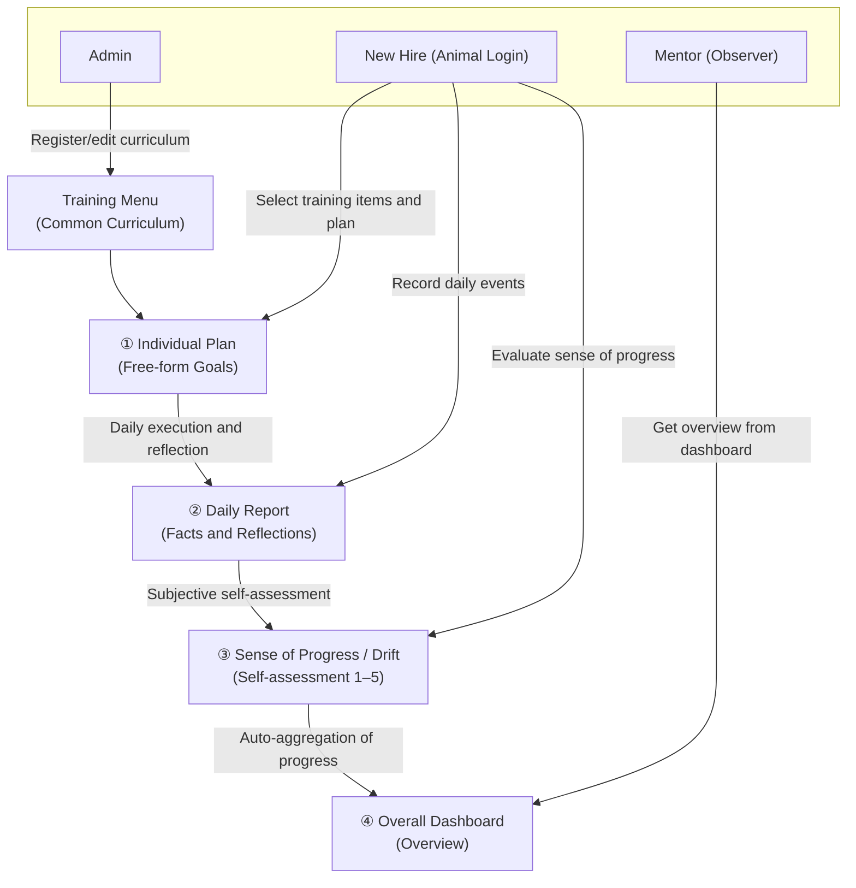

[🇯🇵 日本語](README.md) | [🇬🇧 English](README.en.md)

# Training Scheduler

[](https://github.com/yktsnet/training-scheduler/actions/workflows/ci.yml)
[](https://github.com/yktsnet/training-scheduler/actions/workflows/deploy.yml)

A training support tool designed to foster the autonomy of new employees. By blending "automated system management" with "analog handwriting-like operations," this application is not a rigid progress tracker but a tool for mentors to quietly watch over new hires based on their **subjective sense of progress**.

---

## Quick Start

### Docker (Recommended)

```bash
docker compose up --build
```

Access at http://localhost:5000. SQLite data is persisted in the `db-data` named volume.

### Native Build

**Prerequisites**: [Go 1.25+](https://go.dev/), [Node.js 20+](https://nodejs.org/)

```bash
make build
DEMO_MODE=true ADMIN_PASSWORD=admin123 ./backend/training-app
```

- App URL: http://localhost:5000
  - The port can be changed via the `PORT` environment variable (e.g., `PORT=8080 ./backend/training-app`).
- Initial password for admin login: `admin123`

---

## Overview

This tool is a training planner for small teams built on mutual trust. Unlike typical Gantt chart-style strict progress management tools, it specializes in supporting new hires' proactive self-reflection and mentors' relaxed oversight.

- **Proactive Planning**: The system provides only the framework; new hires write their specific plans in their own words.
- **Visualization of Reflection**: Instead of mechanical progress percentages, shares the individual's "subjective sense of drift" with the manager.
- **Non-intrusive Monitoring**: Managers don't interfere with new hires' autonomy, quietly watching from the dashboard and stepping in only when needed.
- **Loose Identification (Animal Login)**: Instead of strict password authentication, uses a simple login where you just select an animal emoji. A playful account management system premised on team trust. To avoid confusion when the same animal is used by multiple people, an optional initial (e.g., "YT") can be set at registration.

### Demo Mode

The app includes a "Demo Mode" for demonstration purposes (enabled by default).
- **Auto Data Reset**: To prevent tampering during public demos, the DB is automatically restored to initial dummy data (🐶 user, plans, reports, progress) every 30 minutes.
- **Auto Login**: Bypasses the animal selection on first access, instantly experiencing features as the dummy (🐶).
- **Disabling via Environment Variables**:
  For production use, start with `DEMO_MODE=false` and specify the admin login password `ADMIN_PASSWORD`.
  ```bash
  DEMO_MODE=false ADMIN_PASSWORD=your_secure_password ./backend/training-app
  ```

### Admin & Mentor Operations

- **Editing Training Menus**:
  - Add, edit, and delete training menus from the admin panel (password-authenticated). Changes are automatically synced to `menu_config.json`.
- **Checking Progress (Oversight)**:
  - View all trainees' training start dates, progress status (sense of progress), status notes, and past reports in a list from the Dashboard (Overview).

---

## User Interface

### User (Animal Login)


- **Role**: Identification of individuals (new hires, mentors) using the app.
- **Fields**: `emoji` (unique emoji like 🦁 or 🐰), initials (1–3 uppercase English letters).

### Menu (Curriculum)


- **Role**: Master data for the training curriculum (common to all users).
- **Fields**: Name, estimated days, overview, reference URL.
- ※ `internal/database/menu_config.json` serves as the master, automatically synced on startup.

### Plan (Training Plan)


- **Role**: Specific learning plans for each menu item.
- **Fields**: `content` (free-form text), `user_id`.

### Report (Daily Log)


- **Role**: Daily records of facts and reflections.
- **Fields**: `date` (YYYY-MM-DD), `content` (report content), `user_id`.

### Progress (Status & Condition)


- **Role**: Meta information for dashboard display.
- **Fields**: Start date, target days, `offset_days` (subjective drift value 1–5), status notes.

---

## Architecture



---

## Tech Stack

| Layer | Technology | Reason |
|---|---|---|
| **Frontend** | Vue 3, Vite, Vue Router | For simple integration of reactive UI building and single-page application (SPA) routing. |
| **Backend** | Go (Gin), GORM | To leverage Go's high performance and static type safety, providing Web APIs lightly and quickly. |
| **Database** | SQLite (Pure Go driver) | To eliminate external database server setup and operational costs, completing all operations with a single file. |
| **Embedding** | go:embed | To embed frontend build assets (HTML/JS/CSS) directly into the Go binary, enabling distribution and launch with just a single binary. |
| **Container** | Docker, Docker Compose | Multi-stage build produces a lightweight production image, launchable with just `docker compose up`. |

---

## Design Decisions

- **Animal Login (Loose Identification)**:  
  Deliberately avoiding strict password authentication, casual account management is adopted where you simply select an animal emoji. This is designed to lightly share who is working on what, premised on team trust.
- **SQLite + JSON Hybrid Sync**:  
  Edits from the admin screen are written directly to SQLite, but simultaneously written out to `menu_config.json` to ensure consistency in development environments and at deployment. This makes menu settings Git-manageable.
- **Dynamic Date Seeder in Demo Mode**:  
  On demo startup, dates are calculated relative to current time (e.g., "current datetime - 3 days"), designed so that reports and progress always appear as if they are from "the last few days" in a realistic way.

---

## Scope

### In Scope
- Simple login via individual animal (emoji) and initials (e.g., "YT")
- Creation and self-editing of learning plans (Plan) according to the training curriculum
- Simple daily report (Daily Log) input on a per-day basis
- Dashboard (Overview) sharing new hires' subjective drift (sense of progress 1–5) and notes
- CRUD operations on training menus from the admin screen and automatic JSON file saving

### Out of Scope
- General user authentication with passwords (animal login only)
- Direct editing of general user data by mentors or admins (read-only)

---

## Deploy

Pushing to the `main` branch triggers tests and automatic build via GitHub Actions, then automatic deployment to the deployment server. Since frontend static files are embedded in the Go binary, deployment is complete simply by placing the generated single executable on the server and starting it.

---

## Development

### Local Run
Start frontend and backend separately with hot reload enabled for development.

```bash
# First time only: create go:embed stub
make dev-dist

# Terminal 1: Backend (port 5000)
make dev-back

# Terminal 2: Frontend (port 5173, HMR enabled)
make dev-front
```

### Running Tests

```bash
make test
```

No external dependencies (in-memory SQLite). Runs with Go's standard library only.

## How this was built

Development follows an issue-driven workflow that separates design (interactive AI), implementation (autonomous AI), and verification (human merge). An AI agent implements each change starting from an issue file, and dangerous operations are blocked by configuration rather than by convention. The setup lives in [dotfiles-public](https://github.com/yktsnet/dotfiles-public); the process itself is visible in this repository's issues and PRs.
