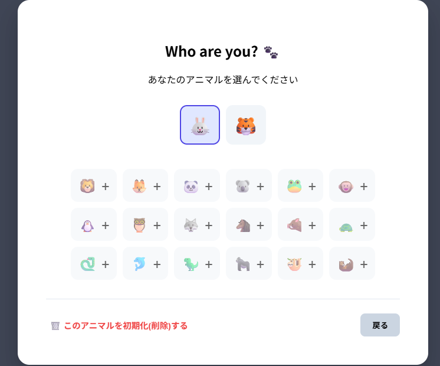
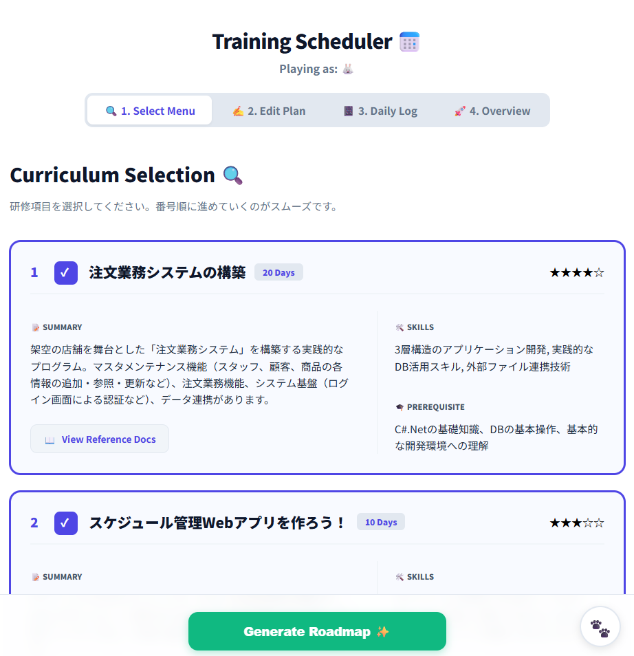
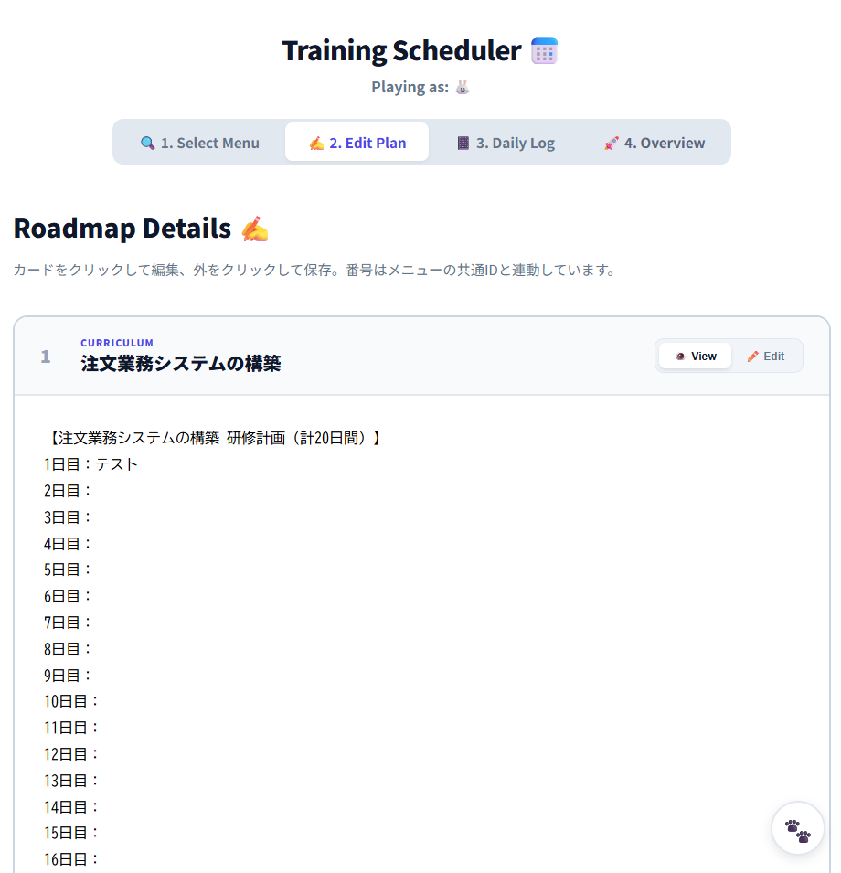
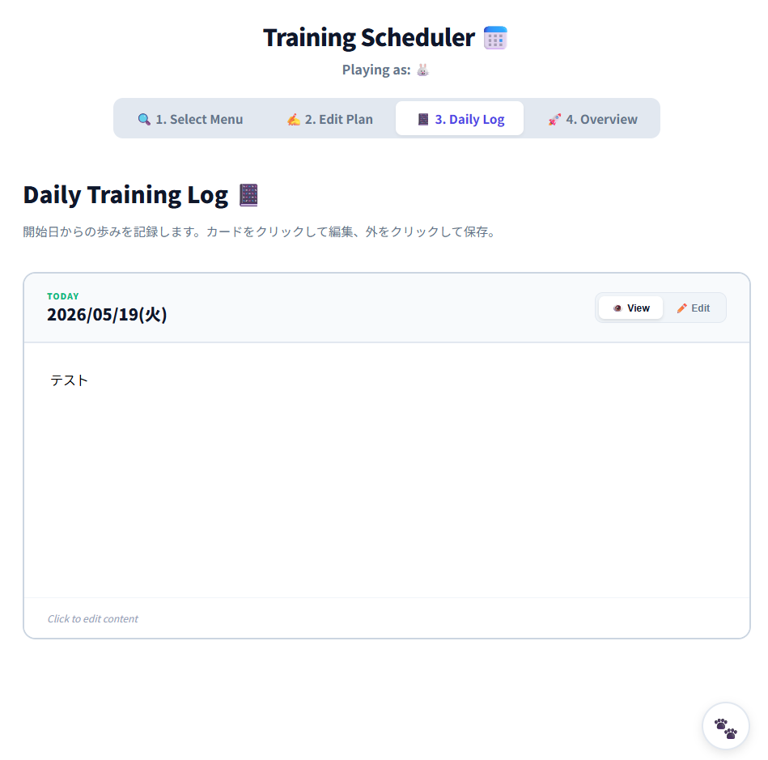
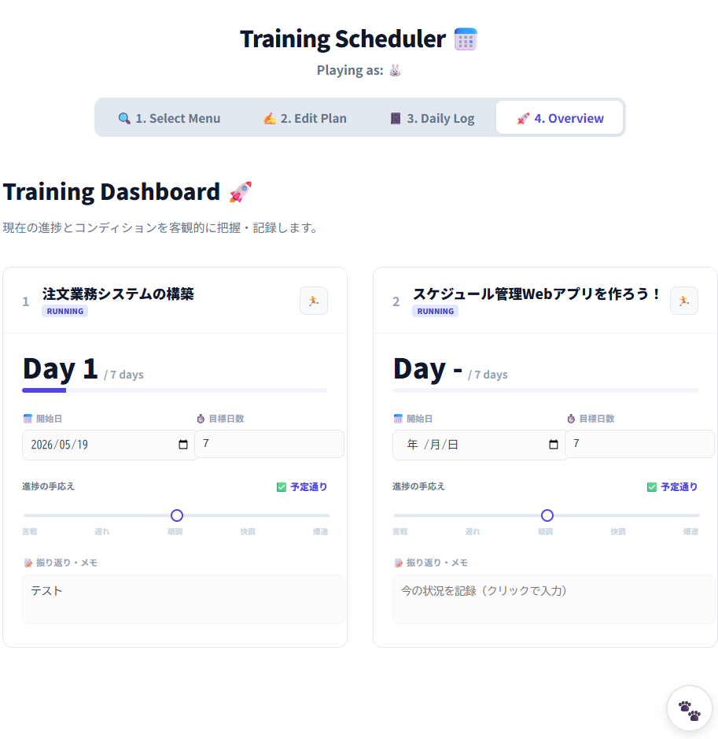
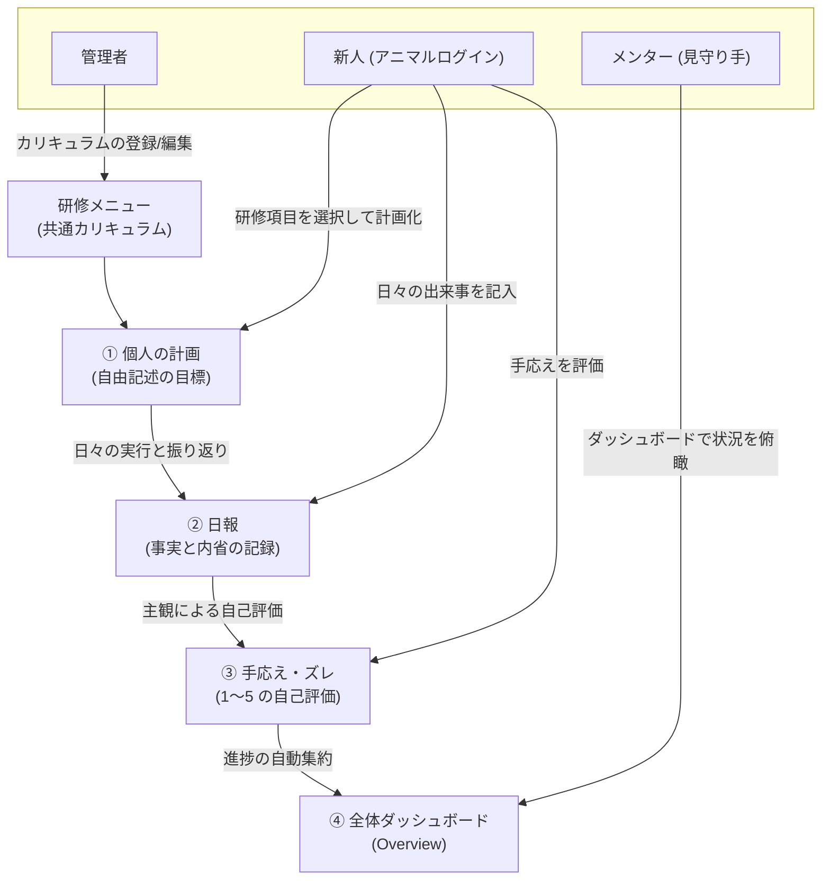

# Training Scheduler

[](https://github.com/yktsnet/training-scheduler/actions/workflows/ci.yml)

新入社員の自律性を促すことを目的とした研修支援ツールです。「システムによる自動管理」と「手書き感覚のアナログ操作」を融合させ、ガチガチの進捗管理ではなく、新人の「主観的な手応え」をベースにメンターが静かに見守るためのアプリケーションです。

---

## Quick Start

### Prerequisites
- [Go 1.25+](https://go.dev/)
- [Node.js 20+](https://nodejs.org/)

### Setup
リポジトリをクローンしてビルドを実行し、Webサーバーを起動します。

```bash
# プロジェクトのビルド（フロントエンドのビルドとGoへの埋め込みを一括実行）
make build

# デモモード（30分ごとの自動リセット有効）かつ初期パスワードを指定して起動
DEMO_MODE=true ADMIN_PASSWORD=admin123 ./backend/training-app
```

- アプリ起動URL: http://localhost:5000
  - ※起動ポートは環境変数 `PORT` を指定することで変更可能です（例: `PORT=8080 ./backend/training-app`）。
- 管理者ログイン用の初期パスワード: `admin123`

---

## Overview

本ツールは、チーム内の信頼関係を前提とした小規模チーム向けの研修プランナーです。一般的なガントチャート型の厳格な進捗管理ツールとは異なり、新人の主体的な内省と、メンターのゆるやかな見守りをサポートすることに特化しています。

- **主体的プランニング**: システムは枠組みだけを提示し、具体的な計画は新人が自身の言葉で記述します。
- **内省の可視化**: 機械的な進捗率（％）の計算ではなく、本人の「主観的なズレ（手応え）」をマネージャと共有します。
- **非干渉の監視**: マネージャは新人の自律を妨げず、ダッシュボードから状況を静かに見守り、必要な時だけサポートに入ります。
- **ゆるやかな識別（アニマル・ログイン）**: パスワード等による厳格な認証ではなく、動物の絵文字を選ぶだけのシンプルなログインを採用。チーム内の信頼関係を前提とした、遊び心のあるアカウント管理です。

### Demo Mode & Admin Panel

本アプリにはデモ用の「デモモード」と、実運用のための「通常モード」が備わっています。

* **デモモード (`DEMO_MODE=true` で起動)**
  * **データ自動リセット**: デモ公開時の改ざんを防ぐため、30分ごとにDBを初期ダミーデータ（🐶 ユーザー、計画、日報、進捗）へ自動復元します。
  * **自動ログイン**: 初回アクセス時のアニマル選択をバイパスし、即座にダミー（🐶）として機能を体験できます。
  * **管理者ログイン**: 管理者画面からカリキュラムを編集できます（デフォルトパスワード: `admin123`）。

* **通常モード (実運用 / デモ無効時)**
  * **クリーン起動**: 自動リセットやダミーデータの自動投入は行われません。アクセス時はアニマル選択画面から始まり、各自がアニマルを新規作成して研修を開始します。
  * **起動方法と環境設定**:
    起動コマンドの引数として直接渡すか、実運用環境で永続化する場合は `systemd` のサービスファイル内の `Environment` 定義や、コンテナの環境変数設定ファイルなどで指定します。
    ```bash
    # 管理者パスワードを設定し、通常モードで起動
    ADMIN_PASSWORD=your_secure_password ./backend/training-app
    ```
    ※ セキュリティのため、実運用時はデフォルトパスワードのままにせず独自のパスワードを設定してください。

---

## User Interface

### User (Animal Login)



- **役割**: アプリを利用する個人（新人・メンター）の識別。
- **項目**: `emoji` (🦁や🐰などのユニークな絵文字)。

### Menu (Curriculum)



- **役割**: 研修カリキュラムのマスターデータ（全ユーザー共通）。
- **項目**: 名称、目安日数、概要、参考URL。
- ※ `internal/database/menu_config.json` をマスターとして起動時に自動同期します。

### Plan (Training Plan)



- **役割**: 各メニューに対する具体的な学習計画。
- **項目**: `content` (自由記述のテキスト)、`user_id`。

### Report (Daily Log)



- **役割**: 日付単位の事実と内省の記録。
- **項目**: `date` (YYYY-MM-DD)、`content` (日報内容)、`user_id`。

### Progress (Status & Condition)



- **役割**: ダッシュボード表示用のメタ情報。
- **項目**: 開始日、目標日数、`offset_days` (主観ズレ値 1〜5)、ステータスメモ。

---

## Architecture



---

## Tech Stack

| Layer | Technology | Reason |
|---|---|---|
| **Frontend** | Vue 3, Vite, Vue Router | リアクティブなUI構築と、シングルページアプリケーション（SPA）のルーティングをシンプルに統合するため。 |
| **Backend** | Go (Gin), GORM | 高パフォーマンスかつ静的なGoの型安全性を活かし、Web APIを軽量かつ高速に提供するため。 |
| **Database** | SQLite (Pure Go driver) | 外部データベースサーバーの設定や運用管理コストをゼロにし、単一ファイルのみで動作を完結させるため。 |
| **Embedding** | go:embed | フロントエンドのビルド資産（HTML/JS/CSS）をGoのバイナリ自体に埋め込み、単一バイナリだけで配布・起動できるようにするため。 |

---

## Design Decisions

- **アニマルログイン（ゆるやかな識別）**: 
  パスワードによる厳格な認証をあえて排し、動物の絵文字を選ぶだけのカジュアルなアカウント管理を採用しています。これはチーム内の信頼関係を前提に、誰がどの作業をしているかを気楽に共有するための設計です。
- **SQLite + JSONのハイブリッド同期**:
  管理画面からの編集はSQLiteへ直接書き込まれますが、開発環境やデプロイ時の整合性を担保するため、同時に `menu_config.json` にも書き出されます。これにより、メニュー設定がGit管理可能になります。
- **デモモードでの動的日付 Seeder**:
  デモ起動時に日付を `現在日時 - 3日` などと相対計算し、日報や進捗が常に「直近数日間」のものとしてリアルに再現されるように設計しています。

---

## Scope

### In Scope
- 各自のアニマル（絵文字）による簡易ログイン
- 研修カリキュラムに応じた学習計画（Plan）の作成と自己編集
- 1日単位のシンプルな日報（Daily Log）入力
- 新人の主観的なズレ（手応え 1〜5）とメモを共有するダッシュボード（Overview）
- 管理者画面からの研修メニューのCRUD操作およびJSONファイルの自動保存

### Out of Scope
- パスワードを用いた一般ユーザー認証（アニマルログインのみ）
- メンターや管理者による一般ユーザーデータの直接編集（読み取りのみ可）

---

## Deploy

`main` ブランチへのプッシュにより、GitHub Actionsでテストおよび自動ビルドが行われ、デプロイ先サーバーへ自動デプロイされます。フロントエンドの静的ファイルがGoバイナリに埋め込まれているため、生成された単一の実行ファイルをサーバーに配置して起動するだけでデプロイが完了します。

---

## Development

### Local Run
開発用にフロントエンドとバックエンドをそれぞれホットリロード有効で起動します。

```bash
# 初回のみ: go:embed 用のスタブ作成
make dev-dist

# ターミナル1: バックエンド (port 5000)
make dev-back

# ターミナル2: フロントエンド (port 5173, HMR有効)
make dev-front
```

### Running Tests

```bash
make test
```

外部依存なし（in-memory SQLite）。Go の標準ライブラリのみで動作します。


